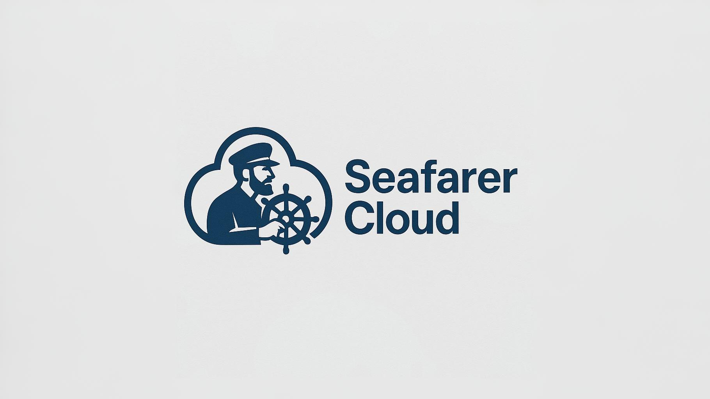

    

  <a href="https://seafarer-cloud.io/">Website</a>
  ·
  <a href="https://seafarer-cloud.io/resources">Documentation</a>
  ·
  <a href="https://seafarer-cloud.io/how-it-works">How it works</a>

<h1></h1>

## About

Seafarer Cloud is a modern cloud infrastructure management platform designed to simplify and automate your cloud operations. Our solution provides an intuitive interface that allows you to deploy, manage, and optimize your resources across multiple cloud providers simultaneously.

Seafarer Cloud offers you:

- Unified and simplified management of your multi-cloud environments
- Intelligent automation of deployments and operations
- Complete visibility into your resources and their costs
- Enhanced security for your entire infrastructure

## Key Features

- **Centralized management console** - Manage all your cloud resources from a single interface
- **Multi-cloud deployment** - Deploy and manage your applications on AWS, Azure, Google Cloud, and other providers
- **Advanced automation** - Create custom workflows to automate recurring operations
- **Monitoring and alerts** - Track the performance and health of your infrastructure in real-time
- **Cost optimization** - Analyze and reduce your cloud expenses with intelligent recommendations

## Benefits

Seafarer Cloud transforms your approach to cloud management:

1. Reduces operational complexity with a unified interface
2. Saves significant time in deploying and managing resources
3. Lowers infrastructure costs through automated optimization
4. Improves security and compliance across your environments
5. Supports multi-cloud and hybrid strategies

## Get Started Today

Simplify your cloud infrastructure with Seafarer Cloud:

- **Free trial** - Test your cloud infrastructure design for free
- **Personalized demo** - Request a demonstration tailored to your specific needs
- **Quick integration** - Connect your existing cloud accounts in just a few minutes
